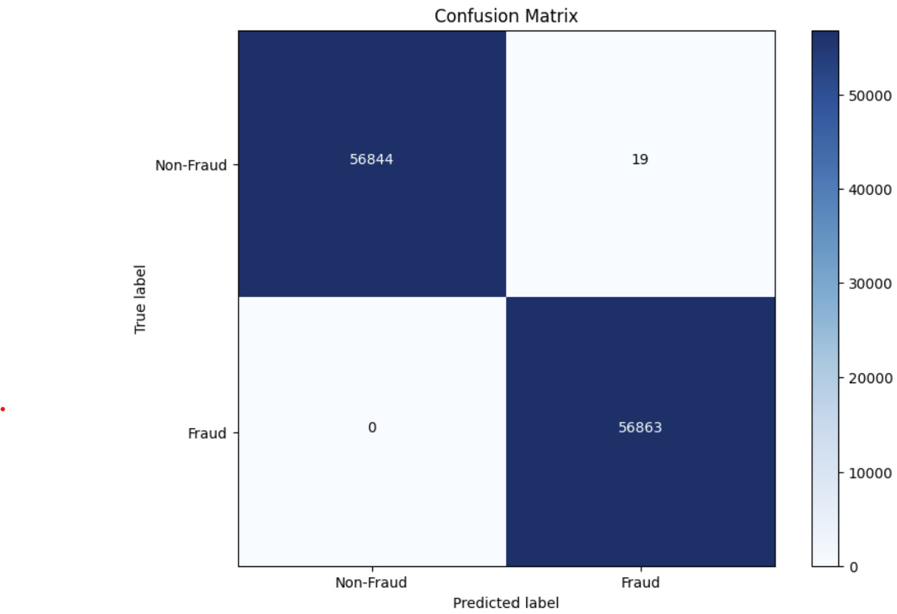

# Credit Card Fraud Detection

## Project Overview
This project aims to detect fraudulent transactions from credit card data using machine learning models. We explore various preprocessing techniques, handle imbalanced datasets, train different models, and evaluate their performance through metrics and visualizations.

## Dataset
The dataset used in this project contains transactions made by credit cards, where each transaction is labeled as fraudulent or legitimate. Due to confidentiality, the features are transformed using PCA, except for the 'Amount' and 'Class' (the label).

## Visualizations

### Confusion Matrix
Here's the confusion matrix for the Random Forest model, showing the performance in distinguishing between fraudulent and legitimate transactions.

### ROC Curve
The ROC curve illustrates the true positive rate against the false positive rate for different threshold values.

### Precision-Recall Curve
Given the imbalance in the dataset, the precision-recall curve is a useful tool to show the trade-off between precision and recall for different thresholds.

### Feature Importance
Understanding which features are most important in predicting fraudulent transactions can provide insights into the nature of the fraud.

## Prerequisites
- Python 3.8+
- pip

